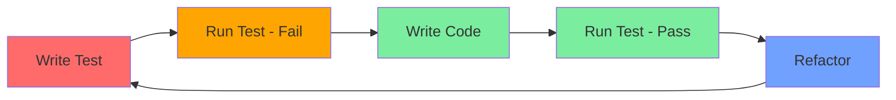

# Unit Testing Implementation Plan

## Project Overview

**Project**: Morr Appz - Next.js 15 E-commerce Management Application  
**Current State**: No testing framework installed  
**Goal**: Implement automated unit testing with error reporting for developers

---

## 1. Executive Summary

This plan outlines the implementation of a comprehensive unit testing strategy for your Next.js 15 application. The current codebase lacks automated testing, which introduces risks of regression bugs and makes debugging more difficult. This document provides:

- Testing framework recommendations
- Project structure for test files
- Best practices for testing React components, Server Actions, and utilities
- Error isolation strategies
- Developer workflow and reporting mechanisms

---

## 2. Current Project Analysis

### 2.1 Technology Stack

| Category | Technology |
|----------|------------|
| Framework | Next.js 15 (App Router) |
| Language | TypeScript 5.9+ |
| UI Library | React 18 |
| Form Handling | React Hook Form + Zod |
| Data Fetching | TanStack Query |
| Authentication | NextAuth v5 |
| Database | Supabase |
| Package Manager | pnpm |

### 2.2 Identified Testable Code

Based on codebase analysis:

1. **Utility Functions** (`lib/utils.ts`):
   - `cn()` - Class name composition
   - `formatDate()` - Date formatting
   - `toSentenceCase()` - String transformation
   - `formatPrice()` - Price formatting
   - `getPageTitle()` - Path to title conversion

2. **Validation Schemas** (`**/validations.ts`):
   - Zod schemas in `app/(authenticated)/*/_lib/validations.ts`
   - Form validation schemas

3. **Server Actions** (`app/(authenticated)/*/actions.ts`):
   - Product management actions
   - Data upload actions
   - User management actions

4. **Data Transformation Functions**:
   - `lib/parsers.ts` - Table parsing utilities
   - `lib/export.ts` - CSV export functions
   - `lib/filter-columns.ts` - Filter logic
   - `lib/ai/utils.ts` - AI message conversion

5. **Authentication** (`auth.ts`):
   - Session
   - Authorization logic handling

---

## 3. Recommended Testing Stack

### 3.1 Primary Recommendations

```mermaid
flowchart TD
    A[Testing Stack] --> B[Vitest]
    A --> C[@testing-library/react]
    A --> D[@testing-library/jest-dom]
    A --> E[MSW]
    A --> F[jest-json-report]
    
    B --> |Fast| G[Unit Tests]
    C --> |Components| G
    D --> |DOM Matchers| G
    E --> |API Mocking| G
    F --> |Reporting| G
```

| Tool | Purpose | Why |
|------|---------|-----|
| **Vitest** | Test runner | Fast, native ESM, compatible with Jest API |
| **@testing-library/react** | Component testing | Accessible, user-centric testing approach |
| **@testing-library/jest-dom** | DOM matchers | Extended Jest matchers for DOM |
| **MSW (Mock Service Worker)** | API mocking | Intercept network requests without actual calls |
| **jest-json-report** | JSON reporting | Generate test reports for CI/CD |

### 3.2 Installation Commands

```bash
# Install core testing dependencies
pnpm add -D vitest @vitest/ui @vitest/coverage-v8
pnpm add -D @testing-library/react @testing-library/jest-dom @testing-library/user-event
pnpm add -D jsdom
pnpm add -D msw@latest --save-dev
pnpm add -D jest-json-report

# Install Vitest configuration for Next.js
pnpm add -D @vitejs/plugin-react
```

---

## 4. Project Structure for Tests

### 4.1 Test File Organization

```
app/
├── lib/
│   ├── utils.ts
│   └── utils.test.ts          # Unit tests for utils
├── (authenticated)/
│   ├── product2/
│   │   ├── actions.ts
│   │   ├── actions.test.ts    # Server Action tests
│   │   └── _lib/
│   │       ├── validations.ts
│   │       └── validations.test.ts
│   └── dataupload/
│       └── _lib/
│           └── validations.test.ts
├── components/
│   ├── ui/
│   │   ├── button.tsx
│   │   └── button.test.tsx
│   └── your-component.tsx
├── __mocks__/                  # Mock files
│   ├── supabase.ts
│   └── next-auth.ts
└── vitest.config.ts
```

### 4.2 Test File Naming Conventions

| Type | Pattern | Example |
|------|---------|---------|
| Unit Tests | `.test.ts` | `utils.test.ts` |
| Component Tests | `.test.tsx` | `Button.test.tsx` |
| Integration Tests | `.integration.test.ts` | `auth.integration.test.ts` |
| Mocks | `.mock.ts` | `supabase.mock.ts` |

---

## 5. Best Practices for This Project

### 5.1 Testing Utility Functions

```typescript
// lib/utils.test.ts
import { describe, it, expect } from 'vitest';
import { formatDate, toSentenceCase, formatPrice, cn } from './utils';

describe('formatDate', () => {
  it('should format Date object', () => {
    const date = new Date('2024-01-15');
    expect(formatDate(date)).toBe('Jan 15, 2024');
  });

  it('should handle string input', () => {
    expect(formatDate('2024-01-15')).toBe('Jan 15, 2024');
  });

  it('should return empty string for invalid date', () => {
    expect(formatDate('invalid')).toBe('');
  });
});

describe('toSentenceCase', () => {
  it('should convert UPPER_CASE to Sentence case', () => {
    expect(toSentenceCase('HELLO WORLD')).toBe('Hello world');
  });

  it('should handle mixed case', () => {
    expect(toSentenceCase('hELLO wORLD')).toBe('Hello world');
  });
});
```

### 5.2 Testing Server Actions

```typescript
// app/(authenticated)/product2/actions.test.ts
import { describe, it, expect, vi, beforeEach } from 'vitest';
import { getWooCategories, getWooProducts } from './actions';

// Mock external dependencies
vi.mock('@/lib/woocommerce', () => ({
  default: vi.fn(),
}));

describe('getWooCategories', () => {
  beforeEach(() => {
    vi.clearAllMocks();
  });

  it('should fetch categories successfully', async () => {
    const mockCategories = [
      { id: 1, name: 'Electronics', slug: 'electronics', parent: 0 },
      { id: 2, name: 'Clothing', slug: 'clothing', parent: 0 },
    ];

    // Import after mocking
    const WooCommerceAPI = (await import('@/lib/woocommerce')).default;
    WooCommerceAPI.mockResolvedValue({
      success: true,
      data: mockCategories,
    });

    const result = await getWooCategories({ search: 'ele' });
    
    expect(result).toHaveLength(2);
    expect(result[0].name).toBe('Electronics');
  });

  it('should throw error on API failure', async () => {
    const WooCommerceAPI = (await import('@/lib/woocommerce')).default;
    WooCommerceAPI.mockResolvedValue({
      success: false,
      error: 'API Error',
    });

    await expect(getWooCategories()).rejects.toThrow('Failed to load categories');
  });
});
```

### 5.3 Testing Zod Validations

```typescript
// app/(authenticated)/dataupload/_lib/validations.test.ts
import { describe, it, expect } from 'vitest';
import { uploadDataSchema } from './validations';

describe('uploadDataSchema', () => {
  it('should validate correct input', () => {
    const validInput = {
      name: 'Test Upload',
      description: 'Test description',
      file: 'test.csv',
    };

    const result = uploadDataSchema.safeParse(validInput);
    expect(result.success).toBe(true);
  });

  it('should reject missing required fields', () => {
    const invalidInput = {
      description: 'Test description',
    };

    const result = uploadDataSchema.safeParse(invalidInput);
    expect(result.success).toBe(false);
    expect(result.error?.issues).toBeDefined();
  });

  it('should validate field constraints', () => {
    const invalidInput = {
      name: 'A', // Too short
    };

    const result = uploadDataSchema.safeParse(invalidInput);
    expect(result.success).toBe(false);
  });
});
```

### 5.4 Testing React Components

```typescript
// components/ui/button.test.tsx
import { describe, it, expect, vi } from 'vitest';
import { render, screen, fireEvent } from '@testing-library/react';
import { Button } from './button';

describe('Button', () => {
  it('should render with text', () => {
    render(<Button>Click me</Button>);
    expect(screen.getByRole('button')).toHaveTextContent('Click me');
  });

  it('should handle click events', () => {
    const handleClick = vi.fn();
    render(<Button onClick={handleClick}>Click me</Button>);
    
    fireEvent.click(screen.getByRole('button'));
    expect(handleClick).toHaveBeenCalledTimes(1);
  });

  it('should be disabled when disabled prop is set', () => {
    render(<Button disabled>Disabled</Button>);
    expect(screen.getByRole('button')).toBeDisabled();
  });
});
```

---

## 6. Error Isolation Strategy

### 6.1 Test Isolation Principles

1. **Mock External Dependencies**
   - Database calls (Supabase)
   - API calls (WooCommerce, AI services)
   - File system operations
   - Environment variables

2. **Use Dependency Injection**
   ```typescript
   // Instead of direct imports
   import { callWooCommerceAPI } from '@/lib/woocommerce';
   
   // Use factory pattern for testability
   export function createWooService(api: WooCommerceAPI = callWooCommerceAPI) {
     return {
       async getProducts() {
         return api('/wc/v3/products', { method: 'GET' });
       }
     };
   }
   ```

3. **Isolate Server Actions**
   ```typescript
   // Mock at the module level
   vi.mock('@/lib/supabase', () => ({
     postgrest: {
       from: vi.fn(() => ({
         select: vi.fn().mockReturnValue({
           eq: vi.fn().mockReturnValue({
             single: vi.fn().mockResolvedValue({ data: {} }),
           }),
         }),
       })),
     },
   }));
   ```

### 6.2 Error Boundary Testing

```typescript
// Error reporting utility
export class TestErrorCollector {
  private errors: TestError[] = [];

  addError(testName: string, error: Error) {
    this.errors.push({
      testName,
      message: error.message,
      stack: error.stack,
      timestamp: new Date().toISOString(),
    });
  }

  getErrors() {
    return this.errors;
  }

  generateReport() {
    return {
      summary: {
        total: this.errors.length,
        byTest: this.errors.reduce((acc, e) => {
          acc[e.testName] = (acc[e.testName] || 0) + 1;
          return acc;
        }, {} as Record<string, number>),
      },
      errors: this.errors,
    };
  }
}
```

---

## 7. Reporting Mechanism

### 7.1 Test Report Configuration

```typescript
// vitest.config.ts
import { defineConfig } from 'vitest/config';
import react from '@vitejs/plugin-react';
import path from 'path';

export default defineConfig({
  plugins: [react()],
  test: {
    environment: 'jsdom',
    globals: true,
    setupFiles: ['./vitest.setup.ts'],
    coverage: {
      provider: 'v8',
      reporter: ['text', 'json', 'html'],
      reportsDirectory: './test-reports',
    },
    JSONReporter: {
      outputFile: './test-reports/results.json',
    },
  },
  resolve: {
    alias: {
      '@': path.resolve(__dirname, './'),
    },
  },
});
```

### 7.2 Custom Reporter for Developer Feedback

```typescript
// reporters/developer-reporter.ts
import type { Reporter } from '@vitest/reporter';

export class DeveloperReporter implements Reporter {
  private errors: Array<{
    test: string;
    file: string;
    error: string;
    suggestion?: string;
  }> = [];

  onTestFail(test) {
    const file = test.file?.name || 'unknown';
    const error = test.result?.err?.message || 'Unknown error';
    
    // Generate suggestions based on error type
    const suggestion = this.generateSuggestion(error);
    
    this.errors.push({
      test: test.name,
      file,
      error,
      suggestion,
    });
  }

  generateSuggestion(error: string): string {
    if (error.includes('does not exist')) {
      return 'Check if the component is properly exported';
    }
    if (error.includes('is not a function')) {
      return 'Verify the mock is properly set up';
    }
    if (error.includes('timeout')) {
      return 'Consider increasing timeout or mocking the async operation';
    }
    return 'Review the test implementation';
  }

  async onFinished() {
    if (this.errors.length === 0) {
      console.log('\n✅ All tests passed!\n');
      return;
    }

    console.log('\n❌ Test Failures - Action Required\n');
    console.log('═'.repeat(60));
    
    for (const err of this.errors) {
      console.log(`📁 File: ${err.file}`);
      console.log(`🧪 Test: ${err.test}`);
      console.log(`❌ Error: ${err.error}`);
      console.log(`💡 Suggestion: ${err.suggestion}`);
      console.log('─'.repeat(60));
    }

    // Generate JSON report
    const report = {
      timestamp: new Date().toISOString(),
      totalErrors: this.errors.length,
      errors: this.errors,
    };
    
    console.log('\n📊 Full report saved to: test-reports/developer-report.json');
  }
}
```

### 7.3 Report Output Example

```
❌ Test Failures - Action Required

════════════════════════════════════════════════════════════
📁 File: app/(authenticated)/product2/actions.test.ts
🧪 Test: getWooCategories should fetch categories successfully
❌ Error: TypeError: Cannot read properties of undefined (reading 'map')
💡 Suggestion: Check if the response data structure matches expectations

────────────────────────────────────────────────────────────
📁 File: lib/utils.test.ts
🧪 Test: formatPrice should format USD correctly
❌ Error: Expected $100.00 to be $1,000.00
💡 Suggestion: Check formatting logic for large numbers

────────────────────────────────────────────────────────────

📊 Full report saved to: test-reports/developer-report.json
```

---

## 8. Developer Workflow Guide

### 8.1 Running Tests

```bash
# Run all tests
pnpm test

# Run tests in watch mode (development)
pnpm test:watch

# Run tests with coverage
pnpm test:coverage

# Run specific test file
pnpm test utils

# Run tests matching pattern
pnpm test --grep "should format"

# Generate JSON report
pnpm test:json

# Run with custom reporter
pnpm test --reporter ./reporters/developer-reporter.ts
```

### 8.2 Package.json Scripts

Add to `package.json`:

```json
{
  "scripts": {
    "test": "vitest",
    "test:watch": "vitest --watch",
    "test:coverage": "vitest --coverage",
    "test:json": "vitest --reporter=json --outputFile=test-reports/results.json",
    "test:ui": "vitest --ui",
    "test:all": "vitest run && pnpm test:json"
  }
}
```

### 8.3 Test-Driven Development Workflow



### 8.4 When to Write Tests

| Priority | What to Test | Rationale |
|----------|--------------|-----------|
| 🔴 High | Utility functions | Core business logic, frequently used |
| 🔴 High | Validation schemas | Data integrity protection |
| 🔴 High | Server Actions | API contract verification |
| 🟡 Medium | React components | UI behavior correctness |
| 🟢 Low | Page components | Integration tests preferred |

---

## 9. Implementation Roadmap

### Phase 1: Setup (Day 1)

- [ ] Install testing dependencies
- [ ] Configure Vitest
- [ ] Setup test environment
- [ ] Configure TypeScript for tests

### Phase 2: Utilities Testing (Day 2)

- [ ] Write tests for `lib/utils.ts`
- [ ] Write tests for `lib/parsers.ts`
- [ ] Write tests for `lib/export.ts`
- [ ] Write tests for `lib/filter-columns.ts`

### Phase 3: Validation Testing (Day 3)

- [ ] Write tests for all Zod schemas
- [ ] Test edge cases
- [ ] Test error messages

### Phase 4: Server Actions Testing (Day 4-5)

- [ ] Mock Supabase client
- [ ] Test product actions
- [ ] Test data upload actions
- [ ] Test user actions

### Phase 5: Component Testing (Day 6-7)

- [ ] Test UI components
- [ ] Test form components
- [ ] Test interactive components

### Phase 6: CI/CD Integration (Day 8)

- [ ] Add test script to CI pipeline
- [ ] Configure JSON reporting
- [ ] Setup automated reporting

---

## 10. Quick Reference Card

### Test Patterns by Code Type

```typescript
// ┌─────────────────────────────────────────────────────────────┐
// │                    QUICK REFERENCE                         │
// ├─────────────────────────────────────────────────────────────┤
// │                                                             │
// │  UTILITY FUNCTIONS                                         │
// │  ─────────────────                                          │
// │  import { fn } from './module'                             │
// │  expect(fn(input)).toBe(expected)                          │
// │                                                             │
// │  ASYNC FUNCTIONS                                            │
// │  ────────────────                                           │
// │  await expect(fn()).resolves.toBe(value)                   │
// │  await expect(fn()).rejects.toThrow('error')                │
// │                                                             │
// │  MOCKING IMPORTS                                            │
// │  ─────────────────                                         │
// │  vi.mock('module-path', () => ({ fn: vi.fn() }))           │
// │                                                             │
// │  REACT COMPONENTS                                           │
// │  ──────────────────                                         │
// │  render(<Component />)                                     │
// │  screen.getByRole('button')                                 │
// │  fireEvent.click(element)                                   │
// │                                                             │
// │  ERROR TESTING                                              │
// │  ────────────────                                           │
// │  expect(() => fn()).toThrow()                               │
// │  expect(result.success).toBe(false)                        │
// │                                                             │
// └─────────────────────────────────────────────────────────────┘
```

---

## 11. Next Steps

1. **Review this plan** and confirm the approach
2. **Approve the implementation** to begin Phase 1
3. **Schedule a walkthrough** with developers to
4. **Create first batch explain the testing workflow of test files** as examples

---

*Document Version: 1.0*  
*Created: 2026-02-20*  
*Project: Morr Appz Unit Testing Strategy*
